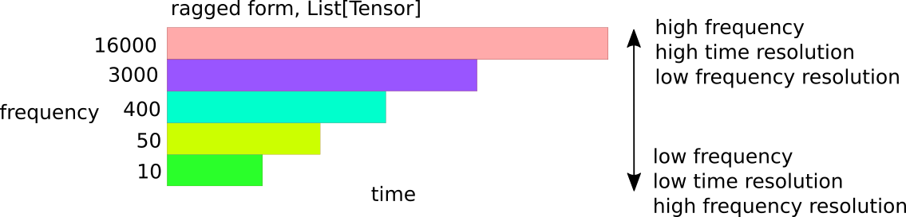

# nsgt

PyTorch implementation of the Nonstationary Gabor Transform and sliCQ Transform, forked from [the reference implementation](https://github.com/grrrr/nsgt):
* Peter Balazs et al, "Theory, implementation and applications of nonstationary Gabor frames." In: Journal of computational and applied mathematics 236 (2011), pp. 1481–1496. doi: 10.1016/j.cam.2011.09.011. url: https://ltfat.github.io/notes/ltfatnote018.pdf.
* Gino Angelo Velasco et al., "Constructing an invertible constant-Q transform with nonstationary Gabor frames." 2011. url: https://www.univie.ac.at/nonstatgab/pdf_files/dohogrve11_amsart.pdf.

This fork adds the following features:
* Bark scale based on the [Barktan formula](https://github.com/stephencwelch/Perceptual-Coding-In-Python/issues/3)
* Variable-Q scale with a frequency offset parameter based on:
    * Christian Schörkhuber et al. “A Matlab Toolbox for Efficient Perfect Reconstruction Time-Frequency Transforms with Log-Frequency Resolution.” In: Proceedings of the AES International Conference. 2014.
    * Dong-Yan Huang, Minghui Dong, and Haizhou Li. “A Real-Time Variable-Q Non-Stationary Gabor Transform for Pitch Shifting.” In: INTERSPEECH – 16th Annual Conference of the International Speech Communication Association. Sept. 2015.
* Minimum slice length suggestion for a given frequency scale
* [PyTorch](https://github.com/pytorch/pytorch/) tensor implementation for faster performance and the capability to use the NSGT or sliCQ in GPU deep learning models
* Support for the ragged/jagged sliCQ transform

The purpose of this fork is to support a [deep learning model for music source separation](https://github.com/sevagh/xumx-sliCQ).

## STFT vs. sliCQ spectrogram

The NSGT or sliCQ allow for nonuniform time-frequency resolution. Following the example of the constant-Q transform, music can be analyzed by maintaining a constant-Q center frequency to frequency resolution ratio per bin, to have high frequency resolution at low frequencies and high time resolution at high frequencies.

The spectrograms below show the magnitude transform of an excerpt of music (10 seconds from [Mestis - El Mestizo](https://www.youtube.com/watch?v=0kn2doStfp4)):


The above was generated with the [examples/spectrogram.py](https://github.com/sevagh/nsgt/blob/torch/examples/spectrogram.py) script with a 48-bin log scale (i.e. CQT) from 83-22050 Hz:
```
(nsgt-torch) $ python examples/spectrogram.py \
                ./mestis.wav --sr 44100 \
                --scale=cqlog --fmin 83.0 --fmax 22050 --bins 48 --sllen=32768 --trlen=4096 \
                --plot
```

## Tensor sliCQ transform

In the diagram below, the NSGT/sliCQ transform output of an audio signal using a simple nonlinear frequency scale, `[10, 50, 400, 3000, 16000] Hz`, is demonstrated in a simplified diagram:



Returned types:

| Parameters | Return type | Shape | Dtype |
|------------|------------|------------|------------|
| **matrixform=True**, real=True, multichannel=True | `torch.Tensor` | (slices,frequency,max(time)) | torch.Complex64 |
| **matrixform=False**, real=True, multichannel=True | `List[torch.Tensor]` | [(slices,freqs1,time1), (slices,freqs2,time2), ...] | torch.Complex64 |

The frequency bins in the ragged case are grouped together by their time resolution. To get the absolute frequency, you need to maintain a frequency index while iterating over the returned list of tensors:
```
freq_idx = 0
for i, C_block in enumerate(jagged_slicq_output):
    freq_start = freq_idx

    print(f'this tensor starts at frequency {freq_start}')

    # advance global frequency pointer
    freq_idx += C_block.shape[2]
```

Here's a sample output from the script [examples/ragged_vs_matrix.py](https://github.com/sevagh/nsgt/blob/torch/examples/ragged_vs_matrix.py):

```
$ python examples/ragged_vs_matrix.py ./mestis.wav --sr 44100 \
              --scale=cqlog --fmin 83.0 --fmax 22050 --bins 12
NSGT-sliCQ jagged shape:
        block 0, f 0: torch.Size([2, 2, 1, 3948])
        block 1, f 1: torch.Size([2, 2, 1, 2024])
        block 2, f 2: torch.Size([2, 2, 1, 3472])
        block 3, f 3: torch.Size([2, 2, 1, 5768])
        block 4, f 4: torch.Size([2, 2, 1, 9580])
        block 5, f 5: torch.Size([2, 2, 1, 15912])
        block 6, f 6: torch.Size([2, 2, 1, 26432])
        block 7, f 7: torch.Size([2, 2, 1, 43908])
        block 8, f 8: torch.Size([2, 2, 1, 72932])
        block 9, f 9: torch.Size([2, 2, 1, 121148])
        block 10, f 10: torch.Size([2, 2, 1, 201240])
        block 11, f 11: torch.Size([2, 2, 1, 334276])
        block 12, f 12: torch.Size([2, 2, 1, 537856])
        block 13, f 13: torch.Size([2, 2, 1, 16])
recon error (mse): 6.658166853412695e-07
```

Compare this to the matrix form:
```
$ python examples/ragged_vs_matrix.py ./mestis.wav --sr 44100 \
              --scale=cqlog --fmin 83.0 --fmax 22050 --bins 12 \
              --matrixform
NSGT-sliCQ matrix shape: torch.Size([2, 2, 14, 537856])
recon error (mse): 2.0801778646273306e-06
```

### Ragged vs. matrix

Due to the complicated nature of the sliCQ transform, it's not very simple to describe how to swap between the ragged and matrix forms. There is a zero-padding step, but not just at the final step before the return.

* In [nsgtf.py](https://github.com/sevagh/nsgt/blob/torch/nsgt/nsgtf.py#L69-L75), zeros are inserted in between the first and second halves of the lower time resolution coefficients to pad them to the size of the largest, followed by an ifft call
* The `arrange` function in [slicq.py](https://github.com/sevagh/nsgt/blob/torch/nsgt/slicq.py#L40) swaps the beginning and ending portions of the transform according to the Blackman-Harris window step

It's best to think of them separately, and it's important to note that in my experience, trying to use the matrix form in a neural network led to supbar results (most probably due to the murky effect of the zero-padding, or "smearing", of the low time resolutions into larger ones).

## Performance


## License and attributions

(carried over from the original readme.txt file)

Python implementation of Non-Stationary Gabor Transform (NSGT)
derived from MATLAB code by NUHAG, University of Vienna, Austria

Thomas Grill, 2011-2017
http://grrrr.org/nsgt

Austrian Research Institute for Artificial Intelligence (OFAI)
AudioMiner project, supported by Vienna Science and Technology Fund (WWTF)

covered by the Artistic License 2.0
http://www.perlfoundation.org/artistic_license_2_0

Original matlab code copyright follows:

AUTHOR(s) : Monika Dörfler, Gino Angelo Velasco, Nicki Holighaus, 2010-2011

COPYRIGHT : (c) NUHAG, Dept.Math., University of Vienna, AUSTRIA
http://nuhag.eu/
Permission is granted to modify and re-distribute this
code in any manner as long as this notice is preserved.
All standard disclaimers apply.
